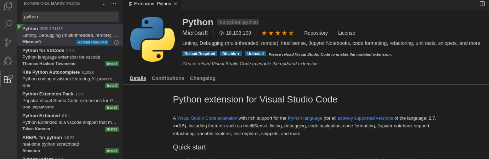
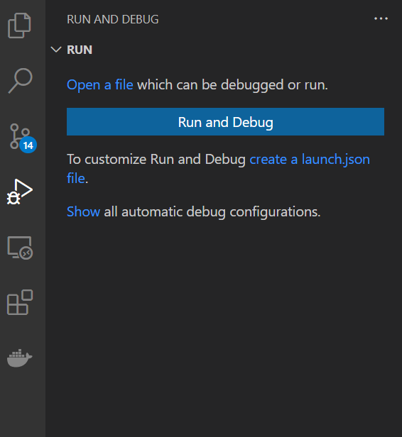
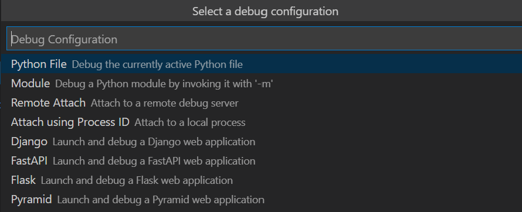

## Visual Studio Code Setup

You can download VS Code for free from its official webpage: https://code.visualstudio.com/. VS Code uses extensions to give it most of its features. We will now install extensions that are useful for us to develop Python. 

> For Windows users using WSL, install the `Remote - WSL` extension from the Marketplace so you can connect VS Code with WSL. If you cannot find where the Marketplace is to install this extension, check out the paragraph below on installing the Python installation, and adapt it for `Remote - WSL`. 

First, install the Python extension from the Marketplace. The Marketplace is the place to install all VS Code addons, and can be accessed by clicking the icon with the 4 square blocks on the lefthand bar of the application (it is the icon highlighted in white below). Then type Python in the search bar, and install the `Python` add-on that is published by Microsoft. It should be the top result, and it should look like the screenshot below, except that you should have a big green install button instead. 

We also recommend you install the `Remote - SSH` plugin so that you can develop on machines you have connected to over ssh. Note that when you connect to a remote machine (this could be either SSH or WSL or Docker containers), it will use the remote machine's VS Code setup. Likely, you will need to install your extensions there again.

The VS Code Python add-on is simply just hooks that connect to your system Python installation. Next, we will configure VS Code so that it is connected with your system Python installation. This means you should have installed python already. Follow the instructions in the [Select a Python Interpreter](https://code.visualstudio.com/docs/python/python-tutorial#_select-a-python-interpreter) section of the official VS code tutorial. Select your preferred python installation (e.g., the ASTRON441 conda environment).Note that VS Code allows you to set the python version on a per user and per workspace basis, which makes it easy to develop for multiple projects that have different python versioning requirements by having a different conda environment for each project. 

When you are done setting up a python interpreter, please run through the [Hello World tutorial](https://code.visualstudio.com/docs/python/python-tutorial) to test that everything works and get a feel for VS Code development in Python (but stop before "Configure and run the debugger" which we will cover later). Finally, watch [this series of 4 short videos](https://drive.google.com/drive/folders/1jzrm8Iy68LwKp7ndE6SVGDaviTNNaDRA?usp=sharing) walking you through some relevant features of VS Code.

## VS Code Debugging Setup

The instructions here are written for trying out the `broken_orbitize.py` file. But you can replace that with any other python you'd like to debug on.

### Installing orbitize!

To run the `broken_orbitize.py` file, you need to first install orbitize. Let's download it here:

    git clone https://github.com/sblunt/orbitize.git

Install `orbitize!` from source by `cd`-ing into this repo you just cloned (there should be a requirements.txt file) and running:

    pip install -r requirements.txt -e .

That command just ran pip to install the package in the current directory, and to automatically update when you make changes to the code (useful for developing on packages). Installing code from source like this also allows you to use the interactive debugger in VS Code on the `orbitize!` source code by default. 

### Configuring the VS Code debugger

Next, get the VS Code debugger set up to run the `broken_orbitize.py` script. You can also use your own script if you prefer; just replace mentions of `broken_orbitize.py` with your own script. If you have not set up the debugger before, open up the `broken_orbitize.py` file, then open the debug tab from the left side (4th buttom from top). Click the "create a launch.json file" link shown in the screenshot below:

When you click it, a new .json file should be created. This specifies how you will debug python scripts in this workspace. Currently it is empty. There should be a buttom in the bottom right of the text editor window that says "Add configuration...". When you click it, a dropdown link should appear to ask you what kind of debugging you would like to do, and select "Python File":

This should create a file `.vscode/launch.json` in the base directory, with default settings for debugging a Python file. We are now almost ready, but I suggest adding the following line inside the configurations list:

    "cwd": "${fileDirname}"

This makes it so that the current working directory of the debugger will always be the directory that the Python file you are debugging is located in. To check you set it all up correctly, it should look nearly identical to the `demo_launch.json` file in this folder. 

Now that you are set up, you can now go to the debug panel, and debug this current file. Get familiar with using the interactive controls (step into, and step over) and/or breakpoints!

If you aren't able to step into orbitize code, you may need to add the following line to your launch.json file:

     "justMyCode": false