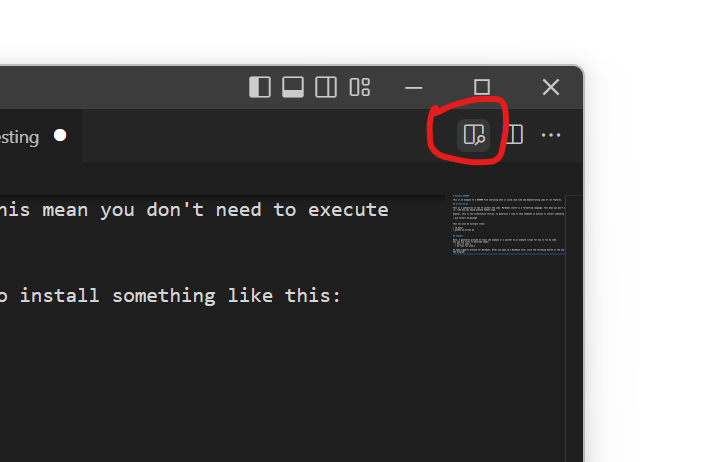

# Example README

This is an example of a README file outlining what it could look like and demonstrating some of its features. 

## Installation

This is a subsection on how to install the code. Markdown itself is a formatting language. This mean you don't need to execute it, like how you would execute Python code. 

However, this is the installation section, so generally I like to show commands to execute to install something like this:
```
> pip install my_package
```

This can also be multiple lines:
```
> cd mydir
> python my_script.py
```

## Example

Here, I generally provide at least one example or a pointer to an example script for how to run my code. 
You can use lists to describe steps:
  * This is step 1
  * Do this for step 2

VS Code supports preview for Markdown. After you open up a Markdown file, click the following button in the top right corner of the program:



Images can be accessed if they are together with the Markdown file, or if you have a URL to one. 

